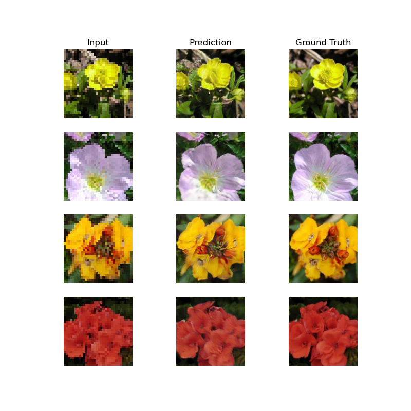

# SRGAN

## Dataset
I used a dataset made of 8.8k images of flowers that are all 224x224 in resolution. I suggest to use images that are higher than 128 pixels in width and height because the data augmentation will center crop the images a little. If you want to use the dataset I used you can download it from this link [here](https://www.robots.ox.ac.uk/~vgg/data/flowers/102/)

## Testing
If you want to test the model with your own images, simply drag and drop the images you would like to be super resolutionized into the `in` folder. Next, navigate to the project directory in a terminal and run `python test.py`. This script will read all the images inside the `in` folder, pass them through to the AI and save the upscaled images in the `out` folder.

## Training
If you wish to train the model, simply create a folder called `dataset` in the root directory of the repo and place your images in there. If your images are too big, I recommend you downscale them beforehand to improve training time. (Optional) adjust the hyperparameters inside `constants.py`. Next, run `python train.py` and the training should start.

## Preview

## Credits
I used the code for the up_conv block and the attention block from this repository: https://github.com/LeeJunHyun/Image_Segmentation/tree/master